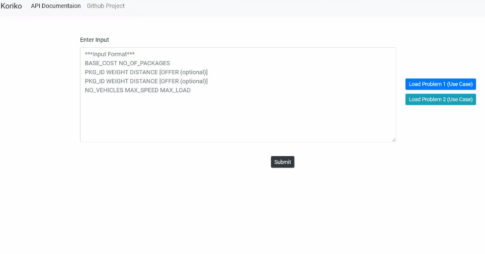
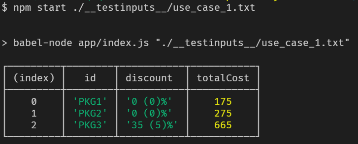
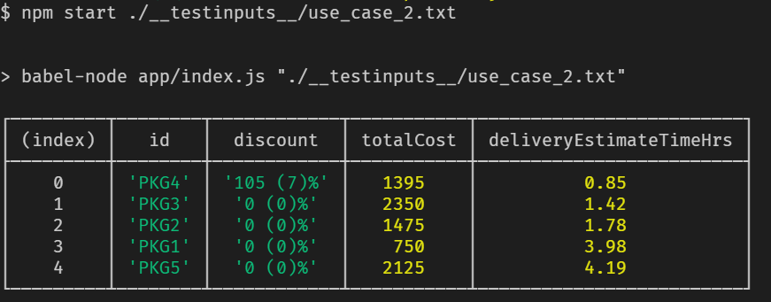

[](https://github.com/rahmancam/koriko/actions)
[](http://standardjs.com)
[](https://app.netlify.com/sites/koriko/deploys)
[](https://github.com/rahmancam/koriko/blob/main/LICENSE)

# Koriko

Koriko is a courier service library to estimate cost and time to deliver the packages. This library is very customizable, and can add custom estimation pipeline to the existing API.

## How it looks



## Getting Started

- Check out the <a href="https://rahmancam.github.io/koriko/" target="_blank">documentation</a>
- Try the <a href="https://koriko.netlify.app" target="_blank">live demo</a> as mentioned above

## What kind of problems it solves

So if you have a courier service and wants to

* estimate cost of the package along with coupon/offers configuraion
* estimate delivery time of the package along with cost, coupon/offers and fleet configurations

## Features

* estimateCost API to estimate cost along with coupon configuration.
* custom estimattor can be added via API (Ex. deduct tax along with totalCost of delivery)
* estimateTime API to allocate shipping/ and fleet
* custom package allocation/ maximzation strategy (default maximizeByNumberOfPackages)
* API can be consumed by any Javascript client/ server (can expose as REST API as well)

## Project Setup

### Installation

This is a [Node.js](https://nodejs.org/en/) library and application

Before installing, [download and install latest Node.js](https://nodejs.org/en/download/).

Installation is done using the
[`npm install` command](https://docs.npmjs.com/getting-started/installing-npm-packages-locally):

```bash
$ npm install
```

### Console App

To run the console application,

#### Usecase 1 (estimateCost)
```bash
$ npm start ./__testinputs__/use_case_1.txt
```


#### Usecase 2 (estimateTime)
```bash
$ npm start ./__testinputs__/use_case_2.txt
```
Output is ordered by deliveryEstimateTimeHrs



You can place your input test files in `__testinputs__` directory and run with your filename.

```bash
$ npm start ./__testinputs__/<file-name>.txt
```
### Test Data Configuration

You can configure coupons and settings via `data/db.json` file.

### Docs Generation
To generate docs site offline usage run,

```bash
$ npm run doc
```
### Web App
To develop the web client run,

```bash
$ npm run web:dev
```
To build the web client run, 

```bash
$ npm run web:build
```
### Tests & Coverage
To run the tests,

```bash
$ npm run test
```

For see the coverage,

```bash
$ npm run test:coverage
```

### Linting
For linting run,

```bash
$ npm run lint
```

## Approach to solve the problem
* composable functional programming style followed. Ex. customDeductTax(applyCoupon(estimateCost()))
* 0 / 1 knapsack algorithm is used to solve the maximization problem (with Dynamic programming approach) 
* custom package allocation/ maximzation strategy is customizable (default maximizeByNumberOfPackages)
* Priority Queue is implemented for fleet allocation

## API Usage

### estimateCost

```js
import { makeDeliveryEstimator } from '../../lib'

const baseCost = 100
const packages = [{ 
                    "id": 'PKG1', 
                    "weightKg": 5, 
                    "distanceKm": 5, "offerCode": 'OFR001' 
                  },
                  { 
                    "id": 'PKG2', 
                    "weightKg": 10, 
                    "distanceKm": 60
                  },{"...": "..."}]

const coupons = [{
            "code": "OFR001",
            "discountPercentage": 10,
            "minDistanceKm": 0,
            "maxDistanceKm": 200,
            "minWeightKg": 70,
            "maxWeightKg": 200
        },
        {"...": "..."}]
const settings = { "costPerKg": 10, "costPerKm": 5 }
const estimator = makeDeliveryEstimator({ baseCost, coupons, settings })
// get package cost estimation with coupons if applicable
const packagesWithCost = estimator.estimateCost(packages)

console.table(packagesWithCost)

```
### estimateTime

```js
import { makeDeliveryEstimator } from '../../lib'

const baseCost = 100
const packages = [{ 
                    "id": 'PKG1', 
                    "weightKg": 5, 
                    "distanceKm": 5, "offerCode": 'OFR001' 
                  },
                  { 
                    "id": 'PKG2', 
                    "weightKg": 10, 
                    "distanceKm": 60
                  },{"...": "..."}]
const coupons = [{
            "code": "OFR001",
            "discountPercentage": 10,
            "minDistanceKm": 0,
            "maxDistanceKm": 200,
            "minWeightKg": 70,
            "maxWeightKg": 200
        },
        {"...": "..."}]
const settings = { "costPerKg": 10, "costPerKm": 5 }

const fleetDetail = { numberOfVehicles: 2, maxSpeedKmPerHr: 70, maxLoadKg: 200 }

const estimator = makeDeliveryEstimator({ baseCost, coupons, settings })
// get shipments with allocated packages, along with cost and delivery time estimations
const shipments = estimator.estimateTime(packages, fleetDetail)

console.table(shipments)
```

## Advanced Customization (Examples)

### Usecase: Addding Tax to estimated Cost
```js
....
....
import baseEstimatorWithCoupon from './ib/core/cost-estimator-with-coupon'

function estimatorWithTaxDeduction (options) {
    const packageItem = baseEstimatorWithCoupon(options)
    return {
      ...packageItem,
      totalCost: packageItem.totalCost - packageItem.totalCost * 0.18 // dedcut 18% Tax (use case)
    }
}

// get package cost estimation along with coupons if applicable and tax dedction
const packagesCostWithTax = estimator.estimateCost(packages, estimatorWithTaxDeduction)

```

### Usecase: Maximize package allocation by deliveryCost
```js
....
....
let defaultCostStragey; // if not defined, default strategy is used
let defaultTimeStragey; // if not defined, default strategy is used

function maximizeByTotalCost(packages) {
  return packages.map(item => item.totalCost)
}

// get shipments with allocated packages, along with cost and delivery time estimations
const shipments = estimator.estimateTime(packages, fleetDetail, defaultCostStragey,
defaultTimeStragey  maximizeByTotalCost)

```

## Input structures

### Package
```json
{ 
    "id": 'PKG1', //string
    "weightKg": 5, //number
    "distanceKm": 5, //number
    "offerCode": 'OFR001' //string (optional)
}
```
### Coupon
```json
{
    "code": "OFR001", // string
    "discountPercentage": 10, // number
    "minDistanceKm": 0, // number
    "maxDistanceKm": 200, // number
    "minWeightKg": 70, // number
    "maxWeightKg": 200 // number
}
```
### Settings
```json
{ 
    "costPerKg": 10, //string
    "costPerKm": 5  // string
}
```
### Fleet
```json
{ 
  "numberOfVehicles": 2, // number
  "maxSpeedKmPerHr": 70, // number
  "maxLoadKg": 200 // number
}
```
## Output structures

### Package
```
class Package {
  /**
   * @property {string} uuid internal unique package Id
   */
  uuid = `${uuid()}`
  /**
   * @property {string} id Package Id
   */
  id = `${uuid()}`;
  /**
   * @property {number} weightKg Package Weight in Kg
   */
  weightKg = 0;
  /**
   * @property {number} distanceKm Package delivery distance in Km
   */
  distanceKm = 0;
  /**
   * @property {string} offerCode Coupon code
   */
  offerCode = '';
  /**
   * @property {number} cost Delivery cost
   */
  cost = 0;
  /**
   * @property {number} discountPercentage Discounted percentage if coupon applied
   */
  discountPercentage = 0;
  /**
   * @property {number} discount Discount amount
   */
  discount = 0;
  /**
   * @property {number} totalCost Total cost of delivery
   */
  totalCost = 0;
  /**
   * @property {number} deliveryEstimateTimeHrs Delivery estimate hours
   */
  deliveryEstimateTimeHrs = 0
  /**
   * @property {number} actualEstimateHrs Actual estimate hours
   */
  actualEstimateHrs = 0
}
```
### Shipment
```
class Shipment {
    /**
     * @property {string} Shipment Id
     */
    id = `${uuid()}`
    /**
     * @property {Array<Package>} packages
     */
    packages = []
    /**
     * Get shipmetn weight
     * @returns {number} Total shipment weight
     */
    getWeightkg ()
}
```